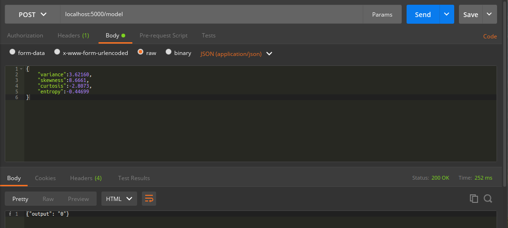

# DeliveryTimePredictionAPI
A Python based Bike time prediction using Decision Tree. I already trained the model and save it on my local system, here you will find the trained model in [Trained Model](server/webapp/model/)

## Getting Started
### Prerequisites
* [Python 3.6](https://www.python.org/downloads/release/python-360/)

### Deployment
For deployment of the project follow [Deployment Guide](docs/deployment.md)

### Project Configuration
For project configuration follow [here](docs/configuration.md)

## How to Give Inputs
For giving input you will need to install [postman](https://www.getpostman.com/)

## Contributors
- [Sameer](https://github.com/sameershewakram)

### Build Using
* [Python 3.6](https://www.python.org/downloads/release/python-360/)
* [Flask](http://flask.pocoo.org/)
* [Sklearn](https://scikit-learn.org/stable/)

## Thanks To
* [Oreilly](https://www.oreilly.com/ideas/how-a-restful-api-server-reacts-to-requests)
* [Linux](https://www.linux.org/)
* [Ubuntu](https://www.ubuntu.com/)
* [Google](https://www.google.com)
